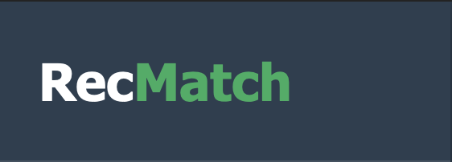
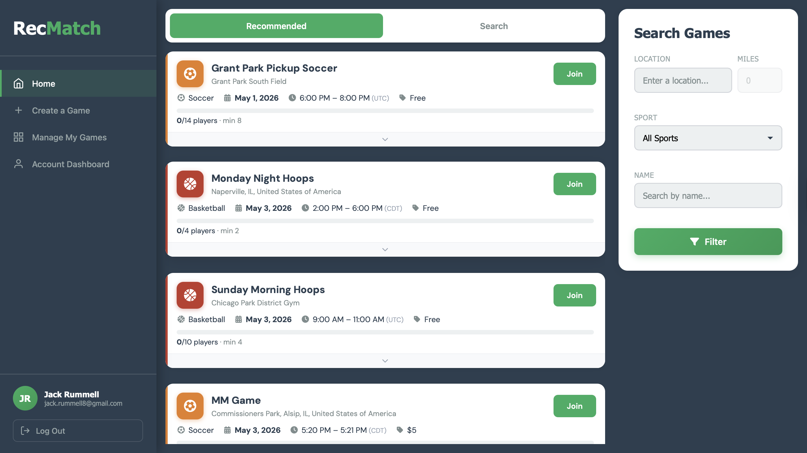
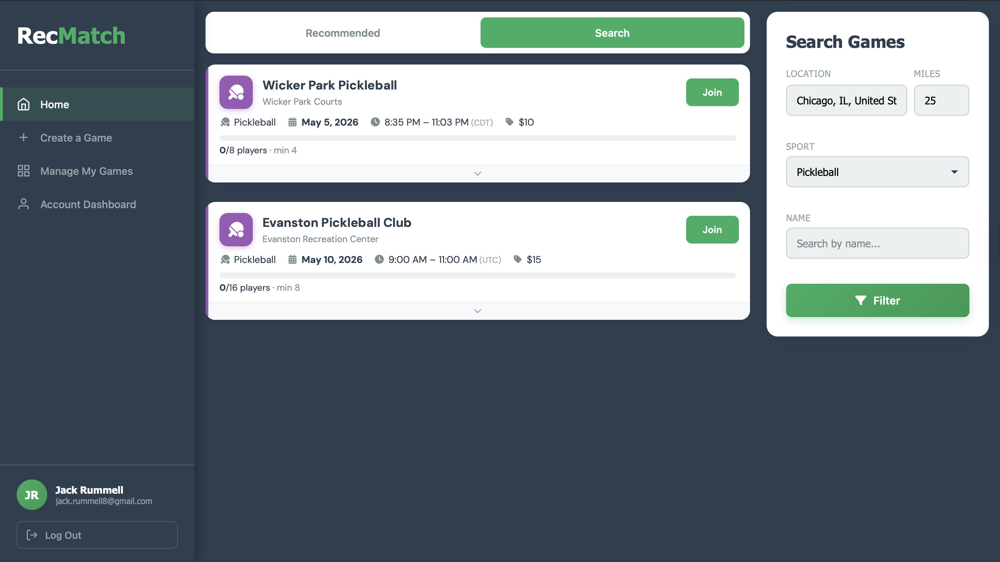
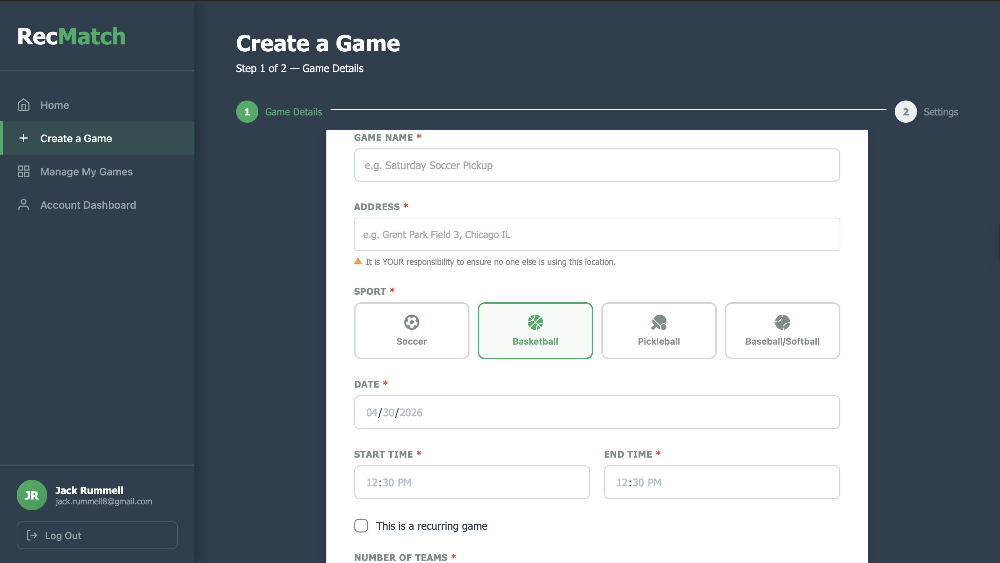
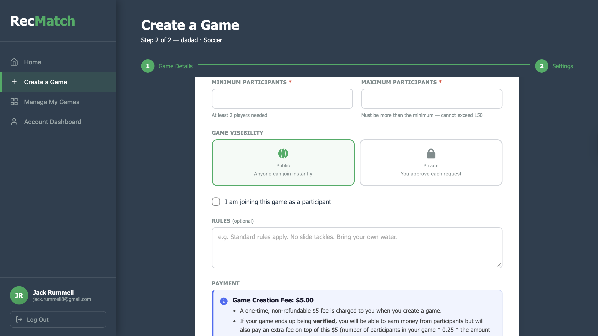
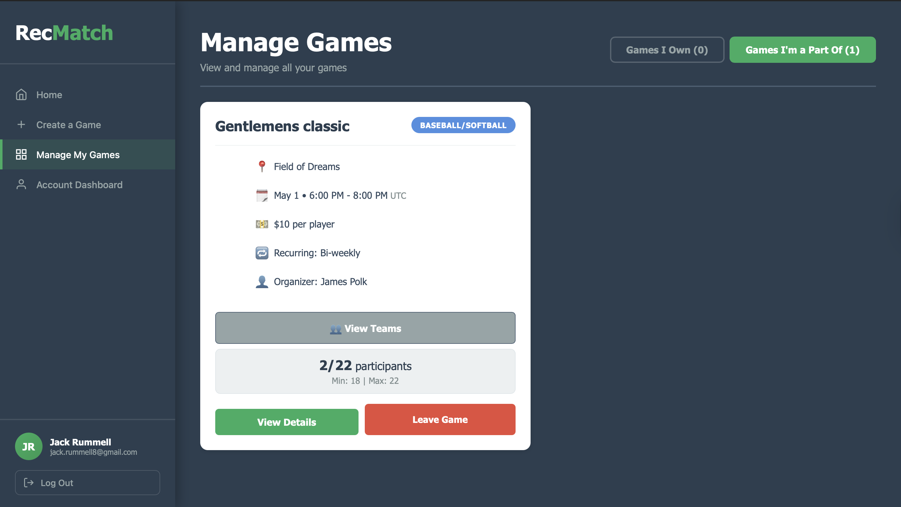
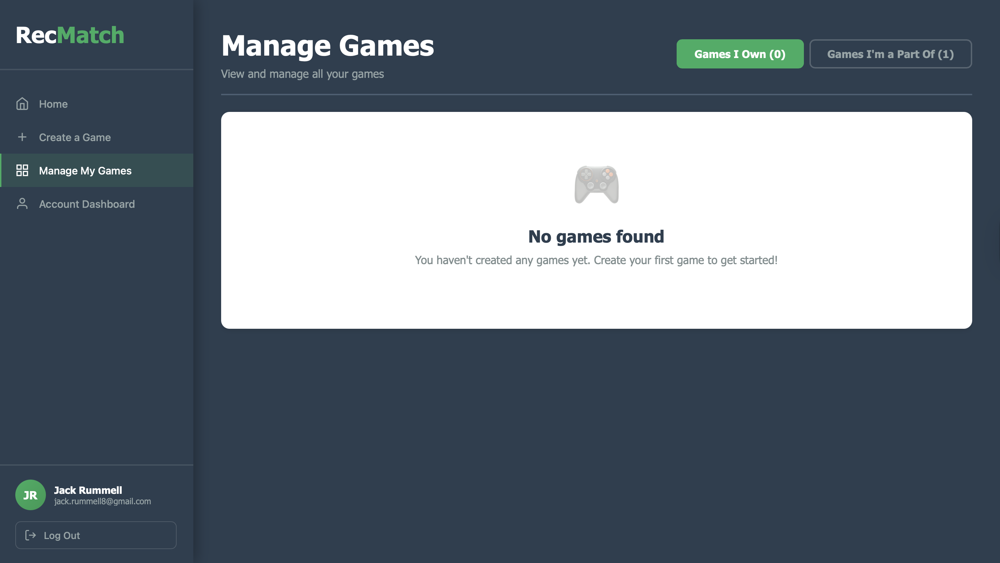
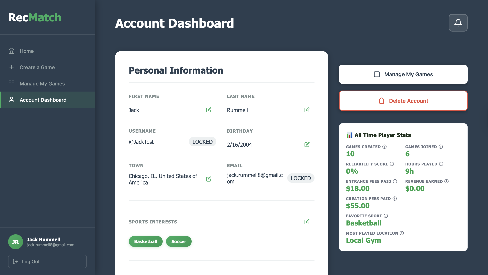

# RecMatch – System Overview

## Overview
RecMatch is a full-stack web application developed as part of a capstone project designed to simplify the process of organizing and joining recreational sports games.

The platform addresses common issues in pickup sports coordination such as scheduling conflicts, poor communication, unreliable attendance, and lack of structure by providing a centralized system for game discovery, creation, payments, and participation tracking.

The application emphasizes scalable backend architecture, data validation, location-based filtering, and user engagement features through a modern client-server web architecture.

---

## My Contributions
- Contributed to backend API development using Node.js and Express.js
- Assisted in implementing game creation workflows and validation logic
- Worked on frontend-backend data flow and API integration
- Helped develop recommendation and filtering functionality
- Participated in database-driven feature implementation using Supabase
- Collaborated in a team-based Agile development environment

---

## Tech Stack
- **Frontend:** React, TypeScript, Vite
- **Backend:** Node.js, Express.js
- **Database:** Supabase (PostgreSQL)
- **Location Services:** Geoapify API
- **Architecture Style:** Client-Server REST API

---

## System Architecture
The application follows a standard client-server architecture:

- Frontend communicates with backend services through REST API calls
- Backend processes requests, applies validation logic, and interacts with Supabase database services
- Supabase stores persistent application data including users, games, payments, statistics, notifications, and verification data
- Environment variables securely manage API keys and service credentials

---

## Key Features

### Game Discovery & Recommendations
- Personalized game recommendations based on user sport preferences
- Distance-based search filtering using geographic coordinates
- Infinite scrolling implementation for scalable browsing
- Automatic exclusion of expired or already joined games

### Game Creation Workflow
- Multi-step game creation process with backend validation
- Unique game verification for organizers
- Integrated payment creation workflow
- Rollback handling to maintain database consistency if payment operations fail
- Coordinate-based location validation using autocomplete APIs

### Player Statistics Dashboard
- Reliability scoring system for organizers
- Games created and joined tracking
- Hours played calculations
- Financial metrics including fees and profits
- Verified-game-based statistical calculations

### Data Integrity & Validation
- Backend validation for critical game fields and participant limits
- Rollback logic for failed transactions
- Soft-delete handling for archived games
- Verification-driven filtering logic for statistics and participation

---

## Example Screens

### Home Recommendations

### Home Search

### Create Game – Step 1

### Create Game – Step 2

### Manage Games – Joined

### Manage Games – Owned

### Account Dashboard

---

## Notes
This repository contains a high-level overview and visual demonstration of the RecMatch capstone project.

The complete source code is maintained in a separate private repository.
